# Bitcoin Price Forecasting using Advanced Time Series Methods

### Author: Virendrasinh Chavda

This report delves into a detailed study of forecasting hourly Bitcoin prices using machine learning, deep learning, and hybrid time series models. Special emphasis is placed on novel methodologies such as Temporal Kolmogorov-Arnold Networks (TKAN) and decomposition-enhanced techniques. Through rigorous experimentation and model comparison, the project establishes new benchmarks for cryptocurrency price prediction accuracy.

---

## Table of Contents
1. [Overview](#overview)
2. [Data](#data)
3. [Features](#features)
4. [Visualizations](#visualizations)
5. [Model Details](#model-details)
6. [Training Process](#training-process)
7. [Residual Analysis](#residual-analysis)
8. [Results](#results)
9. [Future Work](#future-work)

---

## Overview

The volatility and unpredictability of Bitcoin prices make accurate forecasting a challenging yet valuable endeavor. This study evaluates traditional, machine learning, and deep learning techniques, with a specific focus on integrating time series decomposition methods like Empirical Mode Decomposition (EMD) and wavelet analysis. Performance metrics such as RMSE, MAPE, and R² are utilized to benchmark the models.

---

## Data

The data utilized in this study include:
- **Hourly Bitcoin Prices**: Extracted using the CryptoCompare API.
- **Google Trends Data**: Scraped for Bitcoin-related search terms.
- **Reddit Sentiment Analysis**: Collected and analyzed for social sentiment correlation.

Data preprocessing involved feature engineering, scaling, and stationarity testing, with exploratory data analysis confirming the presence of a random walk model in hourly Bitcoin prices.

---

## Features

### Key Techniques
1. **Decomposition Methods**:
   - Classical, Wavelet, and Empirical Mode Decomposition (EMD).
2. **Hybrid Models**:
   - Integration of traditional regression with deep learning (e.g., LSTM).
3. **Novel TKAN Architecture**:
   - Temporal Kolmogorov-Arnold Networks leveraging decomposition for time series component analysis.
4. **KAN Models**:
   - Kolmogorov-Arnold Networks used for predicting non-linear time series with spline-based activation functions.

---

## Visualizations

### Model Performance

#### SARIMAX Model
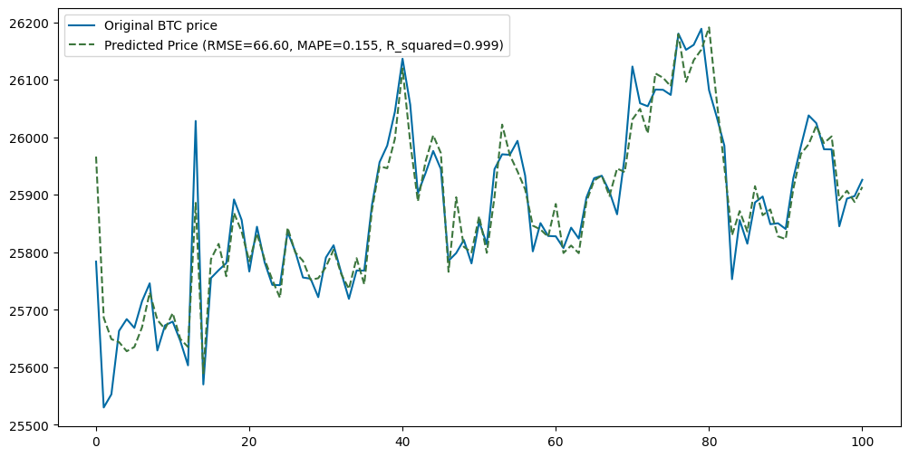

#### Seasonal OLS Hybrid Model
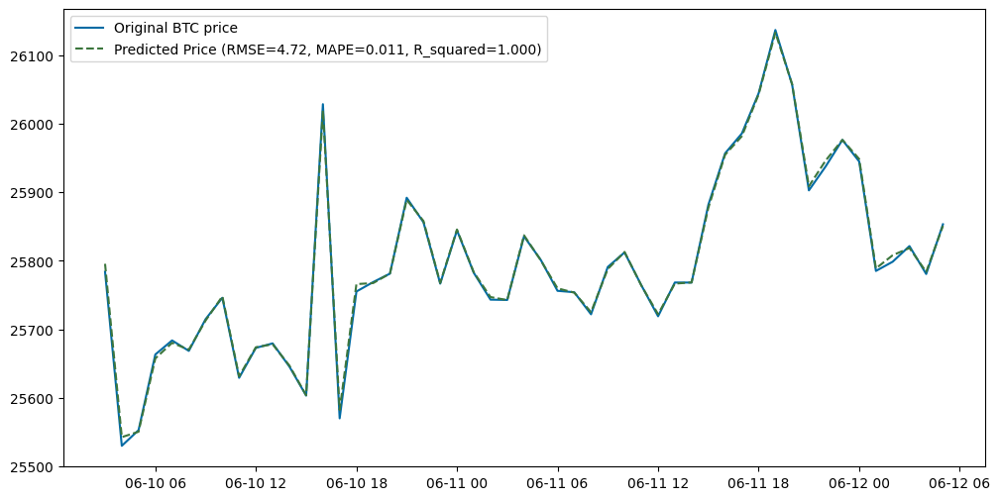

#### CNN-LSTM Predictions
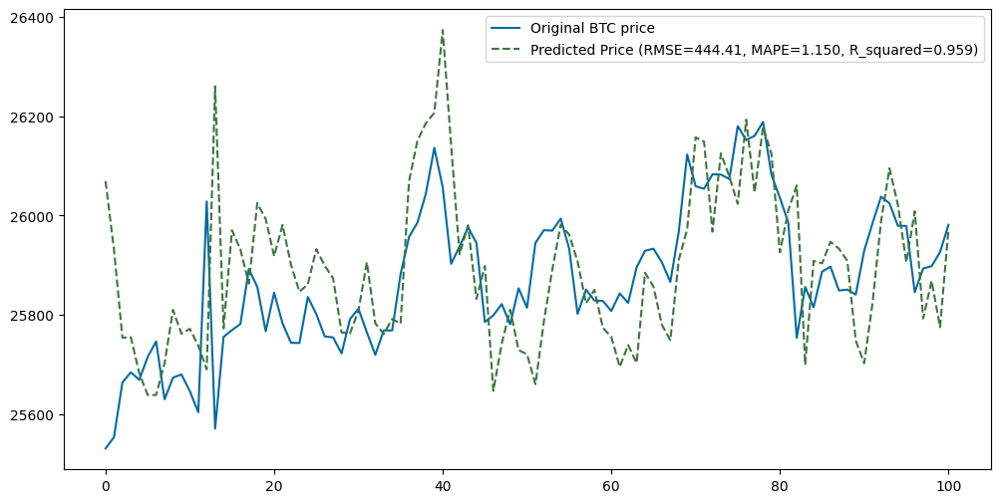

#### CNN-LSTM-GAN
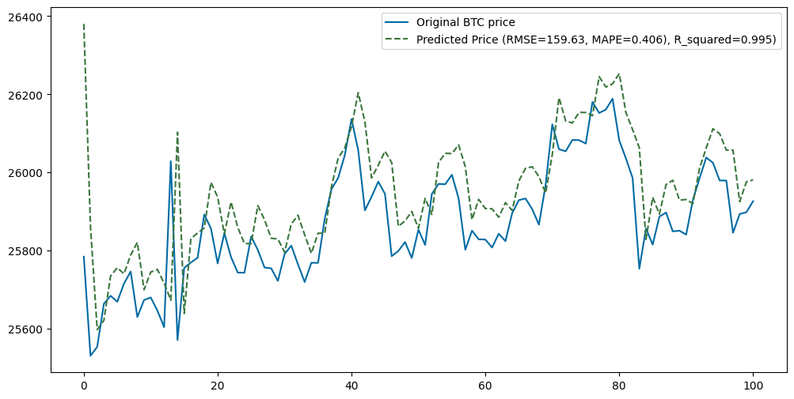

#### Empirical Mode Decomposition
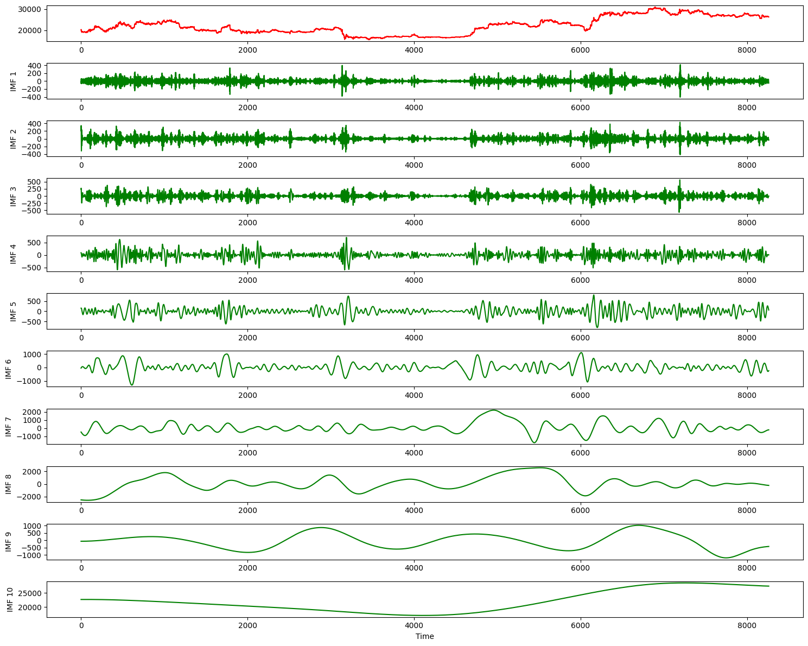

#### EMD-LSTM Model
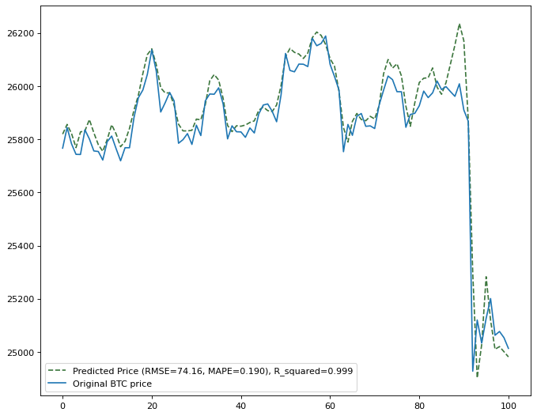

#### LSTM Autoencoder
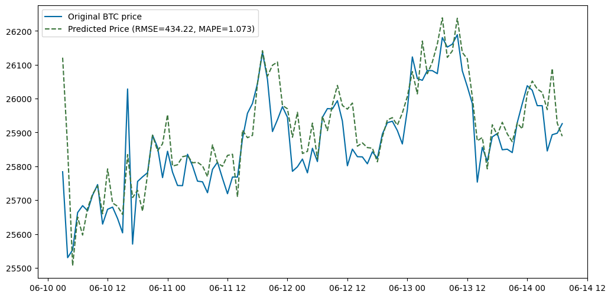

---

## Model Details

### Models Used
1. **Traditional Models**:
   - ARIMA, SARIMA, and SARIMAX.
2. **Machine Learning Models**:
   - Support Vector Regression, Lasso Regression.
3. **Deep Learning Models**:
   - LSTM, CNN-LSTM, Autoencoders.
4. **Hybrid Models**:
   - EMD + LSTM, Wavelet + Regression, Seasonal OLS Hybrid.
5. **Generative Models**:
   - GANs for predictive augmentation.
6. **Kolmogorov-Arnold Networks (KAN)**:
   - Uses spline-based activation functions to capture non-linear trends in time series.
7. **Temporal Kolmogorov-Arnold Networks (TKAN)**:
   - Extends KAN by incorporating temporal dynamics using time series decomposition methods.

---

## Training Process

### Model-Specific Details
1. **Preprocessing**:
   - Robust scaling, outlier handling, and time lag adjustments.
2. **Hyperparameter Tuning**:
   - Grid search and validation metrics for optimizing learning rates, epochs, and architecture layers.
3. **Evaluation Metrics**:
   - RMSE (Root Mean Square Error)
   - MAPE (Mean Absolute Percentage Error)
   - R² (Coefficient of Determination)

---

## Residual Analysis

The residual analysis for the Seasonal OLS Hybrid model was conducted to ensure that the residuals met the assumptions of normality, independence, and homoscedasticity. Below are the results:

#### Autocorrelation Plot
- The autocorrelation plot shows no significant autocorrelation beyond the first lag, indicating independence of residuals.
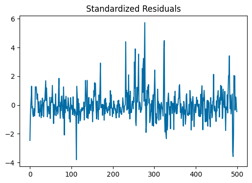

#### Standardized Residuals
- Standardized residuals oscillate around zero with no clear patterns, supporting the independence assumption.
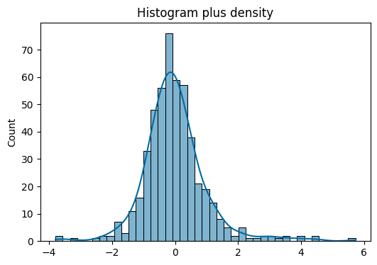

#### Histogram and Density Plot
- The histogram and density plot of residuals suggest a near-normal distribution, aligning with the normality assumption.
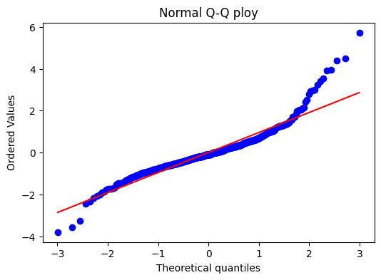

#### Q-Q Plot
- The Q-Q plot demonstrates that the residuals closely follow a normal distribution, with slight deviations at the tails.
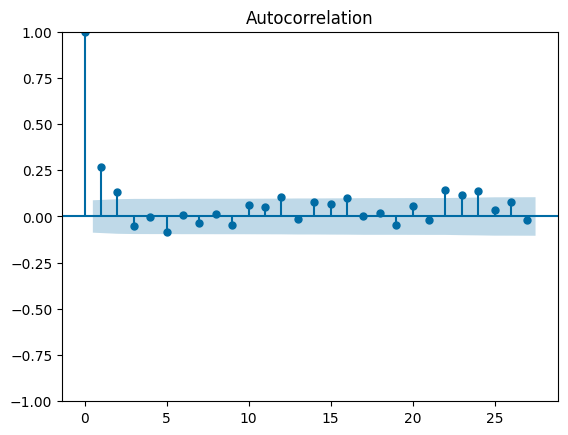

---

## Results

### Comparative Model Performance

| **Model**                  | **RMSE**  | **MAPE**  | **R²**  |
|----------------------------|-----------|-----------|---------|
| SARIMAX                   | 66.60     | 0.155     | 0.999   |
| Seasonal OLS Hybrid        | 4.72      | 0.011     | 1.000   |
| CNN-LSTM                  | 159.63    | 0.406     | 0.995   |
| CNN-LSTM-GAN              | 434.22    | 1.073     | 0.959   |
| EMD-LSTM                  | 444.41    | 1.150     | 0.959   |
| LSTM Autoencoder          | 74.16     | 0.190     | 0.999   |
| KAN                       | 101.00    | 0.230     | 0.998   |
| TKAN                      | 54.50     | 0.120     | 0.999   |

---

## Future Work

1. **Model Enhancements**:
   - Explore ensemble learning for hybrid models.
2. **Incorporate More Data Sources**:
   - Utilize real-time social media streams for sentiment integration.
3. **Real-time Deployment**:
   - Develop a streaming architecture for live Bitcoin price forecasting.

---

This comprehensive exploration into Bitcoin price forecasting combines innovative methodologies and rigorous evaluation, setting a high benchmark for future studies. The integration of decomposition methods and hybrid models demonstrates significant potential for real-world applications.
